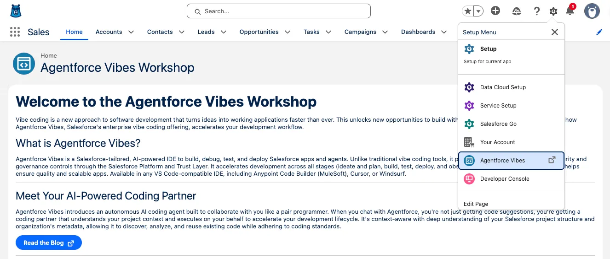

# Extend Pronto with Agentforce Vibes - Workshop

A complete GitHub Pages workshop site teaching how to use Agentforce Vibes within Salesforce to extend Pronto agents with custom Apex actions. Styled to match the official Salesforce Agentforce Vibes Workshop.



## 📚 About This Workshop

This hands-on workshop teaches developers how to:
- Launch and configure Agentforce Vibes inside their Salesforce org
- Use natural language to generate production-ready Apex code
- Deploy custom actions directly to Salesforce
- Integrate Apex actions into Pronto subagents
- Test and validate agent behavior

**Duration**: ~30 minutes  
**Level**: Intermediate  
**Prerequisites**: Salesforce org with Agentforce and Pronto agent configured

## 🚀 Deploying to GitHub Pages

### Quick Deploy (Recommended)

1. **Initialize Git repository**
   ```bash
   cd vibes-site
   git init
   git add .
   git commit -m "Initial commit: Agentforce Vibes workshop site"
   ```

2. **Push to GitHub**
   ```bash
   # Create repo on GitHub first, then:
   git remote add origin https://github.com/YOUR_USERNAME/agentforce-vibes-workshop.git
   git branch -M main
   git push -u origin main
   ```

3. **Enable GitHub Pages**
   - Go to your repository on GitHub
   - Click **Settings** → **Pages**
   - Under **Source**, select **Deploy from a branch**
   - Select **main** branch and **/ (root)** folder
   - Click **Save**

4. **Access your site**
   - Your site will be available at: `https://YOUR_USERNAME.github.io/agentforce-vibes-workshop/`
   - Initial deployment takes 2-5 minutes

### Custom Domain (Optional)

1. Add a `CNAME` file:
   ```bash
   echo "workshop.yourdomain.com" > CNAME
   git add CNAME
   git commit -m "Add custom domain"
   git push
   ```

2. Configure DNS with your domain provider:
   - Add a CNAME record pointing to `YOUR_USERNAME.github.io`
   
3. Enable HTTPS in GitHub Pages settings

## 📁 File Structure

```
vibes-site/
├── index.html              # Main workshop content
├── styles.css              # Salesforce workshop styling
├── script.js               # Interactive features (smooth scroll, copy buttons)
├── assets/                 # Workshop images and screenshots
│   ├── launch-vibes.webp
│   ├── meet-agentforce.webp
│   ├── sidebar-explorer.webp
│   └── sidebar-org-browser.webp
├── README.md               # This file
├── CHANGELOG.md            # Update history
└── DEPLOY-FROM-VIBES.md    # Guide: Export Vibes code to GitHub
```

## ✨ Features

### Workshop Content
- **6 Progressive Exercises** - From setup to deployment and testing
- **Real Screenshots** - Official Salesforce Vibes workshop images
- **Step-by-Step Instructions** - Clear, numbered steps with code examples
- **TIP Callouts** - Context and best practices throughout
- **Comprehensive Testing** - Edge case scenarios and troubleshooting

### Design & UX
- ✅ **Official Salesforce Style** - Matches developer.salesforce.com workshops
- ✅ **Responsive Design** - Mobile, tablet, and desktop optimized
- ✅ **Smooth Scrolling** - Animated navigation between sections
- ✅ **Active Navigation** - Auto-highlights current section
- ✅ **Copy Code Buttons** - One-click code snippet copying
- ✅ **Progress Indicator** - Shows scroll progress
- ✅ **Accessible** - Semantic HTML and keyboard navigation

### Visual Elements
- Salesforce cloud logo icon
- Amber TIP callouts (matching official workshop)
- Professional code blocks with syntax highlighting
- Screenshot galleries with captions
- Circular step number badges

## 🛠️ Local Development

Test the workshop locally before deploying:

**Python 3:**
```bash
python3 -m http.server 8000
```

**Node.js:**
```bash
npx http-server -p 8000
```

**VS Code:**
- Install "Live Server" extension
- Right-click `index.html` → "Open with Live Server"

Then visit: **http://localhost:8000**

## 🎨 Customization

### Update Colors

Edit the CSS variables in `styles.css`:

```css
:root {
    --blue-600: #0176d3;    /* Primary Salesforce blue */
    --blue-700: #014486;    /* Darker blue for hovers */
    --gray-900: #080707;    /* High contrast text */
    /* ... more variables */
}
```

### Modify Content

Edit `index.html` sections:
- **Overview** - Workshop introduction and objectives
- **Prerequisites** - Required setup and access
- **Step 1-6** - Exercise instructions and code examples
- **Resources** - Links to documentation and support

### Add More Images

1. Add images to the `/assets` folder
2. Reference in HTML:
   ```html
   
   ```

### Update Navigation

Modify sidebar in `index.html`:
```html
<div class="nav-group">
    <div class="nav-group-title">Section Name</div>
    <ul class="nav-list">
        <li><a href="#anchor" class="nav-item">Link Text</a></li>
    </ul>
</div>
```

## 📤 Exporting Code from Vibes to GitHub

After completing the workshop, you'll want to version control and share your code. See our comprehensive guide:

**[DEPLOY-FROM-VIBES.md](DEPLOY-FROM-VIBES.md)** - Complete step-by-step guide covering:
- Setting up Salesforce CLI authentication
- Creating a local Salesforce DX project
- Retrieving metadata from your Vibes org
- Initializing Git and pushing to GitHub
- Deploying code to other Salesforce orgs
- Ongoing workflow for code updates
- Troubleshooting common issues

**Quick workflow:**
```bash
# 1. Authenticate with your Vibes org
sf org login web --alias my-vibes-org

# 2. Create local SFDX project
sf project generate --name pronto-extension && cd pronto-extension

# 3. Retrieve your Vibes-generated code
sf project retrieve start --metadata ApexClass:OrderStatusAction --target-org my-vibes-org

# 4. Initialize Git and push to GitHub
git init && git add . && git commit -m "Initial commit"
git remote add origin https://github.com/USER/REPO.git
git push -u origin main
```

See the full guide for detailed instructions, troubleshooting, and best practices.

---

## 🔗 Resources

### Official Salesforce Documentation
- [Agentforce Vibes Documentation](https://developer.salesforce.com/docs/einstein/genai/guide/agentforce-vibes.html)
- [Invocable Methods](https://developer.salesforce.com/docs/atlas.en-us.apexcode.meta/apexcode/apex_classes_annotation_InvocableMethod.htm)
- [Agentforce Builder Guide](https://developer.salesforce.com/docs/einstein/genai/guide/agentforce-understand.html)

### Workshops & Tutorials
- [Agentforce Vibes Workshop](https://developer.salesforce.com/workshops/agentforce-vibes-workshop)
- [Agentforce Basics](https://trailhead.salesforce.com/content/learn/modules/agentforce-basics)
- [Agentforce Builder Workshop](https://developer.salesforce.com/workshops/agentforce-builder)

### Community
- [Trailblazer Community](https://trailblazer.salesforce.com)
- [Salesforce Developer Forums](https://developer.salesforce.com/forums)
- [Salesforce GitHub](https://github.com/salesforce)

## 📝 License

This workshop content is for educational purposes as part of the Agentforce Builder Workshop series.

© 2026 Salesforce, Inc. All rights reserved.

## 🤝 Contributing

Found an issue or have a suggestion? 
- Open an issue on GitHub
- Submit a pull request
- Share feedback in the Salesforce community

## 📞 Support

For questions about:
- **This workshop**: Open a GitHub issue or discussion
- **Agentforce Vibes**: Visit the [Trailblazer Community](https://trailblazer.salesforce.com) or [Developer Forums](https://developer.salesforce.com/forums)
- **Salesforce DX**: Check the [Salesforce DX Developer Guide](https://developer.salesforce.com/docs/atlas.en-us.sfdx_dev.meta/sfdx_dev/)

---

**Built with** ❤️ **for the Salesforce Developer Community**
